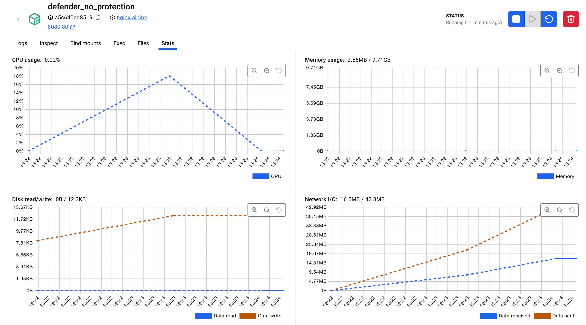
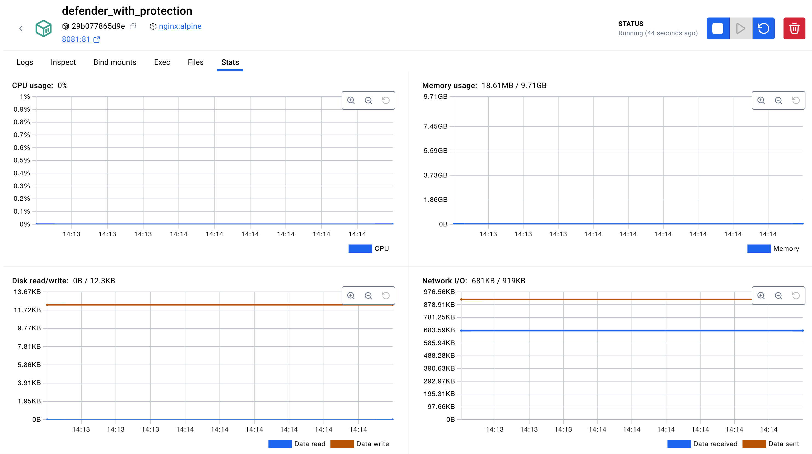
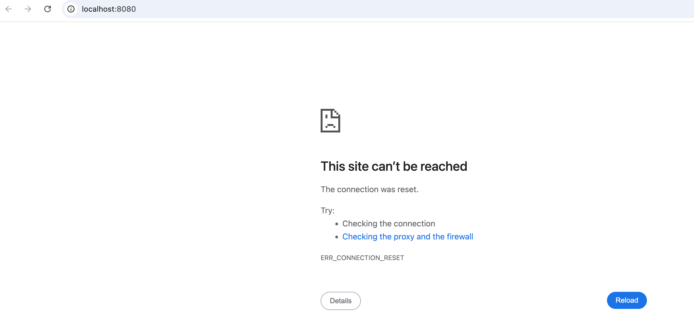
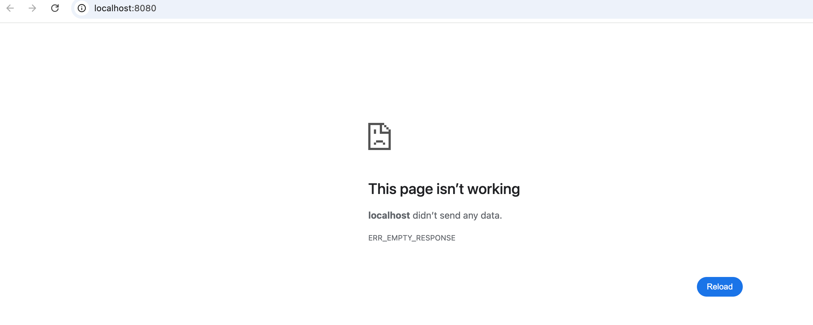
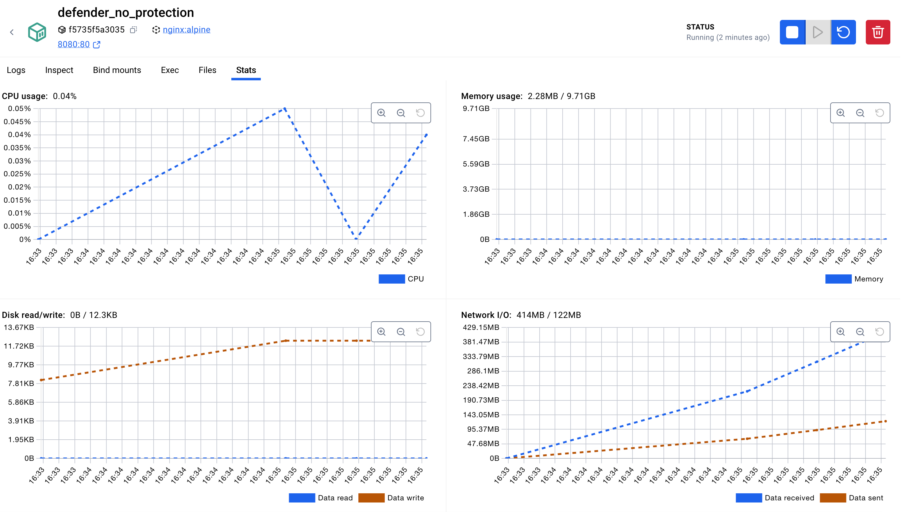
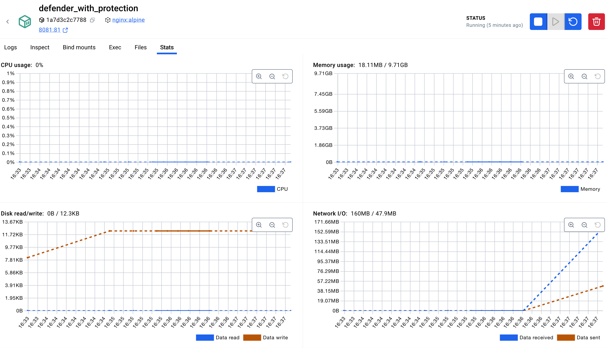

## DDoS attacks

Experiment based on making DDos attacks to nginx protected and not protected servers.
Commands are run on attacker container.

### Http Flood
Standard GET requests flood a web server.

`./http-flood.sh defender_no_protection:80`

`./http-flood.sh defender_with_protection:81`

[error] 35#35: *1285 limiting requests, excess: 20.630 by zone "one", client: 172.18.0.4, server: , request: "GET / HTTP/1.1", host: "defender_with_protection:81"

### ICMP Flood
Sends Internet Control Message Protocol (ICMP) echo request packets (pings) to a host

`./icpm-flood.sh 172.15.0.3 80`


### Ping of Death

`./ping-of-death.sh defender_with_protection`

`./ping-of-death.sh defender_no_protection`

Both servers keep alive. By the end of 1997, operating system vendors had made patches available to avoid the ping of death.

### Slowloris
Slowloris tries to keep many connections to the target web server open and hold them open as long as possible.

`./slowloris.sh defender_no_protection`

`./slowloris.sh defender_with_protection`


### Syn Flood
In a SYN flood attack, the attacker does not respond with a final ACK. The server is left with a large number of unfinished SYN-ACK requests that burden the system.

`./syn-flood.sh defender_no_protection 8080`

`./syn-flood.sh defender_with_protection 8081`


### UDP Flood
The host checks the ports for the appropriate applications. When no application can be found, the system responds to every request with a “destination unreachable” packet.

`./udp-flood.sh defender_no_protection 8080`

```
/ # tcpdump -i eth0 udp
tcpdump: verbose output suppressed, use -v[v]... for full protocol decode
listening on eth0, link-type EN10MB (Ethernet), snapshot length 262144 bytes
21:52:45.466319 IP 42.208.58.134.47442 > f1eb4db6e800.8080: UDP, length 0
21:52:45.466390 IP host-94-91-205-181.business.telecomitalia.it.47443 > f1eb4db6e800.8080: UDP, length 0
21:52:45.466443 IP 225.239.58.94.47444 > f1eb4db6e800.8080: UDP, length 0
